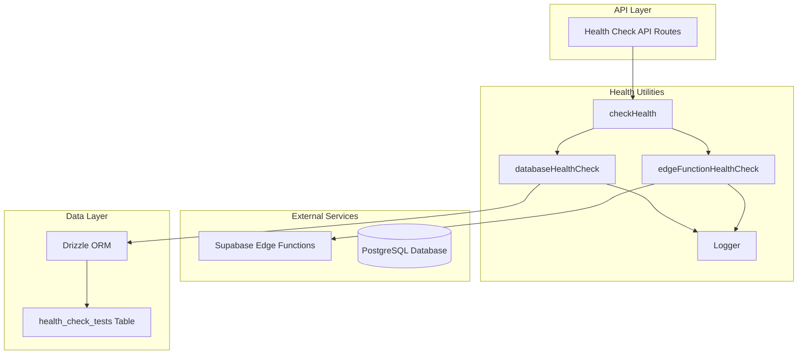

# Health Check System Architecture Design

## Overview

This document describes the architecture for a robust Health Check System that validates both Supabase Edge Functions and Database connectivity through a unified interface. The system provides detailed error reporting, performance metrics, and comprehensive logging for operational monitoring.

## System Architecture



## Directory Structure

```
src/lib/health/
├── index.ts                    # Main exports
├── types.ts                    # TypeScript type definitions
├── edge-functions.ts           # Edge Functions health check utilities
├── database.ts                 # Database health check utilities
└── logger.ts                   # Health check logging utilities
```

## Type Definitions

### Core Health Check Types

```typescript
// src/lib/health/types.ts

/**
 * Health status enumeration
 */
export type HealthStatus = 'healthy' | 'unhealthy' | 'error' | 'warning' | 'pending'

/**
 * Base health check result interface
 */
export interface HealthCheckResult {
  status: HealthStatus
  responseTimeMs: number
  timestamp: string
  error?: string
  details?: Record<string, unknown>
}

/**
 * Edge Function health check result
 */
export interface EdgeFunctionHealthResult extends HealthCheckResult {
  type: 'edge-function'
  functionName: string
  endpoint: string
  httpStatus?: number
  authValidated?: boolean
}

/**
 * Database health check result
 */
export interface DatabaseHealthResult extends HealthCheckResult {
  type: 'database'
  operation: 'write' | 'read' | 'delete'
  table: string
  recordId?: string
}

/**
 * Unified health check result
 */
export interface UnifiedHealthResult {
  overall: HealthStatus
  edgeFunctions: EdgeFunctionHealthResult[]
  database: DatabaseHealthResult[]
  responseTimeMs: number
  timestamp: string
  errors: string[]
}

/**
 * Edge Function check configuration
 */
export interface EdgeFunctionCheckConfig {
  functionName: string
  endpoint?: string
  validateAuth?: boolean
  authToken?: string
  timeout?: number
}

/**
 * Database check configuration
 */
export interface DatabaseCheckConfig {
  tableName?: string
  testKey?: string
  testValue?: string
}

/**
 * Health check options
 */
export interface HealthCheckOptions {
  edgeFunctions?: EdgeFunctionCheckConfig[]
  database?: DatabaseCheckConfig
  timeout?: number
  verbose?: boolean
}

/**
 * Health check error types
 */
export class HealthCheckError extends Error {
  constructor(
    message: string,
    public readonly component: string,
    public readonly originalError?: unknown
  ) {
    super(message)
    this.name = 'HealthCheckError'
  }
}

export class EdgeFunctionHealthError extends HealthCheckError {
  constructor(
    message: string,
    public readonly functionName: string,
    public readonly httpStatus?: number,
    originalError?: unknown
  ) {
    super(message, 'edge-function', originalError)
    this.name = 'EdgeFunctionHealthError'
  }
}

export class DatabaseHealthError extends HealthCheckError {
  constructor(
    message: string,
    public readonly operation: 'write' | 'read' | 'delete',
    public readonly tableName: string,
    originalError?: unknown
  ) {
    super(message, 'database', originalError)
    this.name = 'DatabaseHealthError'
  }
}
```

## Utility Functions Design

### Edge Functions Health Check (`edge-functions.ts`)

```typescript
// src/lib/health/edge-functions.ts

import { supabaseAdmin } from '@/lib/supabase/admin'
import { env } from '@/config/env'
import type {
  EdgeFunctionHealthResult,
  EdgeFunctionCheckConfig,
  EdgeFunctionHealthError,
} from './types'
import { logger } from './logger'

/**
 * Ping an Edge Function to verify connectivity
 * 
 * @param config - Edge function check configuration
 * @returns Promise<EdgeFunctionHealthResult>
 * 
 * @throws EdgeFunctionHealthError if invocation fails
 */
export async function pingEdgeFunction(
  config: EdgeFunctionCheckConfig
): Promise<EdgeFunctionHealthResult> {
  const start = performance.now()
  const functionName = config.functionName || 'health-check'
  
  logger.info(`Pinging edge function: ${functionName}`)

  try {
    const { data, error } = await supabaseAdmin.functions.invoke(functionName, {
      body: { message: 'ping' },
    })

    if (error) {
      const errorDetails = error as { context?: string; message?: string }
      throw new EdgeFunctionHealthError(
        `Edge function invocation failed: ${error.message || 'Unknown error'}`,
        functionName,
        undefined,
        error
      )
    }

    const responseTimeMs = Math.round(performance.now() - start)
    
    logger.success(`Edge function ping successful: ${functionName} (${responseTimeMs}ms)`)

    return {
      type: 'edge-function',
      status: 'healthy',
      responseTimeMs,
      timestamp: new Date().toISOString(),
      functionName,
      endpoint: `${env.NEXT_PUBLIC_SUPABASE_URL}/functions/v1/${functionName}`,
      details: { data },
    }
  } catch (error) {
    const responseTimeMs = Math.round(performance.now() - start)
    const errorMessage = error instanceof Error ? error.message : 'Unknown error'
    
    logger.error(`Edge function ping failed: ${functionName}`, { error: errorMessage })
    
    if (error instanceof EdgeFunctionHealthError) {
      return {
        type: 'edge-function',
        status: 'error',
        responseTimeMs,
        timestamp: new Date().toISOString(),
        functionName,
        endpoint: `${env.NEXT_PUBLIC_SUPABASE_URL}/functions/v1/${functionName}`,
        error: errorMessage,
        details: { originalError: error.originalError },
      }
    }
    
    return {
      type: 'edge-function',
      status: 'error',
      responseTimeMs,
      timestamp: new Date().toISOString(),
      functionName,
      endpoint: `${env.NEXT_PUBLIC_SUPABASE_URL}/functions/v1/${functionName}`,
      error: errorMessage,
    }
  }
}

/**
 * Validate JWT authentication with Edge Function
 * 
 * @param config - Edge function check configuration with auth token
 * @returns Promise<EdgeFunctionHealthResult>
 * 
 * @throws EdgeFunctionHealthError if auth validation fails
 */
export async function validateEdgeFunctionAuth(
  config: EdgeFunctionCheckConfig
): Promise<EdgeFunctionHealthResult> {
  const start = performance.now()
  const functionName = config.functionName || 'health-check'
  const authToken = config.authToken

  logger.info(`Validating auth for edge function: ${functionName}`)

  // If no auth token provided, return warning status
  if (!authToken) {
    const responseTimeMs = Math.round(performance.now() - start)
    
    logger.warn(`No auth token provided for edge function: ${functionName}`)
    
    return {
      type: 'edge-function',
      status: 'warning',
      responseTimeMs,
      timestamp: new Date().toISOString(),
      functionName,
      endpoint: `${env.NEXT_PUBLIC_SUPABASE_URL}/functions/v1/${functionName}`,
      authValidated: false,
      error: 'No auth token provided - skipping auth validation',
      details: { skipped: true, reason: 'No Authorization header provided' },
    }
  }

  try {
    const { data, error } = await supabaseAdmin.functions.invoke(functionName, {
      body: { message: 'auth-check' },
      headers: {
        // Send auth in custom header to avoid Supabase Gateway interference
        'x-test-auth': authToken,
      },
    })

    if (error) {
      throw new EdgeFunctionHealthError(
        `Auth validation failed: ${error.message || 'Unknown error'}`,
        functionName,
        undefined,
        error
      )
    }

    const responseTimeMs = Math.round(performance.now() - start)
    
    logger.success(`Auth validation successful for edge function: ${functionName} (${responseTimeMs}ms)`)

    return {
      type: 'edge-function',
      status: 'healthy',
      responseTimeMs,
      timestamp: new Date().toISOString(),
      functionName,
      endpoint: `${env.NEXT_PUBLIC_SUPABASE_URL}/functions/v1/${functionName}`,
      authValidated: true,
      details: { data },
    }
  } catch (error) {
    const responseTimeMs = Math.round(performance.now() - start)
    const errorMessage = error instanceof Error ? error.message : 'Unknown error'
    
    logger.error(`Auth validation failed for edge function: ${functionName}`, { error: errorMessage })
    
    if (error instanceof EdgeFunctionHealthError) {
      return {
        type: 'edge-function',
        status: 'error',
        responseTimeMs,
        timestamp: new Date().toISOString(),
        functionName,
        endpoint: `${env.NEXT_PUBLIC_SUPABASE_URL}/functions/v1/${functionName}`,
        authValidated: false,
        error: errorMessage,
        details: { originalError: error.originalError },
      }
    }
    
    return {
      type: 'edge-function',
      status: 'error',
      responseTimeMs,
      timestamp: new Date().toISOString(),
      functionName,
      endpoint: `${env.NEXT_PUBLIC_SUPABASE_URL}/functions/v1/${functionName}`,
      authValidated: false,
      error: errorMessage,
    }
  }
}

/**
 * Run all Edge Function health checks
 * 
 * @param configs - Array of edge function check configurations
 * @returns Promise<EdgeFunctionHealthResult[]>
 */
export async function runEdgeFunctionHealthChecks(
  configs: EdgeFunctionCheckConfig[] = []
): Promise<EdgeFunctionHealthResult[]> {
  const defaultConfigs: EdgeFunctionCheckConfig[] = [
    { functionName: 'health-check', validateAuth: false },
  ]

  const checksToRun = configs.length > 0 ? configs : defaultConfigs

  logger.info(`Running ${checksToRun.length} edge function health checks`)

  const results = await Promise.allSettled(
    checksToRun.map(async (config) => {
      const pingResult = await pingEdgeFunction(config)
      
      if (config.validateAuth) {
        const authResult = await validateEdgeFunctionAuth(config)
        return [pingResult, authResult]
      }
      
      return [pingResult]
    })
  )

  const flattenedResults: EdgeFunctionHealthResult[] = []
  results.forEach((result) => {
    if (result.status === 'fulfilled') {
      flattenedResults.push(...result.value)
    } else {
      // Handle rejected promises
      logger.error('Edge function check promise rejected', { error: result.reason })
    }
  })

  return flattenedResults
}
```

### Database Health Check (`database.ts`)

```typescript
// src/lib/health/database.ts

import { db } from '@/server/db'
import { healthCheckTests } from '@/server/db/schema'
import { eq } from 'drizzle-orm'
import type { DatabaseHealthResult, DatabaseCheckConfig, DatabaseHealthError } from './types'
import { logger } from './logger'

const DEFAULT_TEST_KEY = 'health-check-test'

/**
 * Write a test row to the database
 * 
 * @param config - Database check configuration
 * @returns Promise<DatabaseHealthResult>
 * 
 * @throws DatabaseHealthError if write operation fails
 */
export async function writeTestRow(
  config: DatabaseCheckConfig = {}
): Promise<DatabaseHealthResult> {
  const start = performance.now()
  const testKey = config.testKey || DEFAULT_TEST_KEY
  const testValue = config.testValue || `test-${Date.now()}`

  logger.info(`Writing test row to database: ${testKey}`)

  try {
    // Delete any existing test row first to ensure clean state
    await db.delete(healthCheckTests).where(eq(healthCheckTests.testKey, testKey))

    // Insert new test row
    const [result] = await db
      .insert(healthCheckTests)
      .values({
        testKey,
        testValue,
      })
      .returning()

    if (!result) {
      throw new DatabaseHealthError(
        'Insert returned no result',
        'write',
        'health_check_tests'
      )
    }

    const responseTimeMs = Math.round(performance.now() - start)
    
    logger.success(`Database write successful: ${testKey} (${responseTimeMs}ms)`)

    return {
      type: 'database',
      status: 'healthy',
      responseTimeMs,
      timestamp: new Date().toISOString(),
      operation: 'write',
      table: 'health_check_tests',
      recordId: result.id,
      details: { testKey, testValue },
    }
  } catch (error) {
    const responseTimeMs = Math.round(performance.now() - start)
    const errorMessage = error instanceof Error ? error.message : 'Unknown error'
    
    logger.error(`Database write failed: ${testKey}`, { error: errorMessage })
    
    return {
      type: 'database',
      status: 'error',
      responseTimeMs,
      timestamp: new Date().toISOString(),
      operation: 'write',
      table: 'health_check_tests',
      error: errorMessage,
    }
  }
}

/**
 * Read a test row from the database
 * 
 * @param config - Database check configuration
 * @returns Promise<DatabaseHealthResult>
 * 
 * @throws DatabaseHealthError if read operation fails
 */
export async function readTestRow(
  config: DatabaseCheckConfig = {}
): Promise<DatabaseHealthResult> {
  const start = performance.now()
  const testKey = config.testKey || DEFAULT_TEST_KEY

  logger.info(`Reading test row from database: ${testKey}`)

  try {
    const [result] = await db
      .select()
      .from(healthCheckTests)
      .where(eq(healthCheckTests.testKey, testKey))
      .limit(1)

    const responseTimeMs = Math.round(performance.now() - start)
    
    if (!result) {
      logger.warn(`No test row found in database: ${testKey}`)
      
      return {
        type: 'database',
        status: 'healthy',
        responseTimeMs,
        timestamp: new Date().toISOString(),
        operation: 'read',
        table: 'health_check_tests',
        details: { found: false, testKey },
      }
    }
    
    logger.success(`Database read successful: ${testKey} (${responseTimeMs}ms)`)

    return {
      type: 'database',
      status: 'healthy',
      responseTimeMs,
      timestamp: new Date().toISOString(),
      operation: 'read',
      table: 'health_check_tests',
      recordId: result.id,
      details: {
        found: true,
        testKey,
        testValue: result.testValue,
        createdAt: result.createdAt,
      },
    }
  } catch (error) {
    const responseTimeMs = Math.round(performance.now() - start)
    const errorMessage = error instanceof Error ? error.message : 'Unknown error'
    
    logger.error(`Database read failed: ${testKey}`, { error: errorMessage })
    
    return {
      type: 'database',
      status: 'error',
      responseTimeMs,
      timestamp: new Date().toISOString(),
      operation: 'read',
      table: 'health_check_tests',
      error: errorMessage,
    }
  }
}

/**
 * Delete a test row from the database
 * 
 * @param config - Database check configuration
 * @returns Promise<DatabaseHealthResult>
 * 
 * @throws DatabaseHealthError if delete operation fails
 */
export async function deleteTestRow(
  config: DatabaseCheckConfig = {}
): Promise<DatabaseHealthResult> {
  const start = performance.now()
  const testKey = config.testKey || DEFAULT_TEST_KEY

  logger.info(`Deleting test row from database: ${testKey}`)

  try {
    // Check if row exists first
    const [existing] = await db
      .select()
      .from(healthCheckTests)
      .where(eq(healthCheckTests.testKey, testKey))
      .limit(1)

    if (!existing) {
      const responseTimeMs = Math.round(performance.now() - start)
      
      logger.warn(`No test row to delete in database: ${testKey}`)
      
      return {
        type: 'database',
        status: 'healthy',
        responseTimeMs,
        timestamp: new Date().toISOString(),
        operation: 'delete',
        table: 'health_check_tests',
        details: { deleted: false, testKey },
      }
    }

    // Delete the row
    await db.delete(healthCheckTests).where(eq(healthCheckTests.testKey, testKey))

    const responseTimeMs = Math.round(performance.now() - start)
    
    logger.success(`Database delete successful: ${testKey} (${responseTimeMs}ms)`)

    return {
      type: 'database',
      status: 'healthy',
      responseTimeMs,
      timestamp: new Date().toISOString(),
      operation: 'delete',
      table: 'health_check_tests',
      recordId: existing.id,
      details: { deleted: true, testKey },
    }
  } catch (error) {
    const responseTimeMs = Math.round(performance.now() - start)
    const errorMessage = error instanceof Error ? error.message : 'Unknown error'
    
    logger.error(`Database delete failed: ${testKey}`, { error: errorMessage })
    
    return {
      type: 'database',
      status: 'error',
      responseTimeMs,
      timestamp: new Date().toISOString(),
      operation: 'delete',
      table: 'health_check_tests',
      error: errorMessage,
    }
  }
}

/**
 * Run full CRUD health check on database
 * 
 * @param config - Database check configuration
 * @returns Promise<DatabaseHealthResult[]>
 */
export async function runDatabaseHealthChecks(
  config: DatabaseCheckConfig = {}
): Promise<DatabaseHealthResult[]> {
  logger.info('Running database health checks (CRUD)')

  const results: DatabaseHealthResult[] = []

  // Write test row
  const writeResult = await writeTestRow(config)
  results.push(writeResult)

  // Only proceed with read and delete if write succeeded
  if (writeResult.status === 'healthy') {
    // Read test row
    const readResult = await readTestRow(config)
    results.push(readResult)

    // Delete test row
    const deleteResult = await deleteTestRow(config)
    results.push(deleteResult)
  }

  return results
}
```

### Logger Utility (`logger.ts`)

```typescript
// src/lib/health/logger.ts

/**
 * Health check logger for detailed operational logging
 */
export const logger = {
  /**
   * Log informational message
   */
  info(message: string, meta?: Record<string, unknown>): void {
    console.log(`[HealthCheck INFO] ${message}`, meta ? JSON.stringify(meta) : '')
  },

  /**
   * Log successful operation
   */
  success(message: string, meta?: Record<string, unknown>): void {
    console.log(`[HealthCheck SUCCESS] ${message}`, meta ? JSON.stringify(meta) : '')
  },

  /**
   * Log warning
   */
  warn(message: string, meta?: Record<string, unknown>): void {
    console.warn(`[HealthCheck WARN] ${message}`, meta ? JSON.stringify(meta) : '')
  },

  /**
   * Log error
   */
  error(message: string, meta?: Record<string, unknown>): void {
    console.error(`[HealthCheck ERROR] ${message}`, meta ? JSON.stringify(meta) : '')
  },

  /**
   * Log debug information (only in development)
   */
  debug(message: string, meta?: Record<string, unknown>): void {
    if (process.env.NODE_ENV === 'development') {
      console.debug(`[HealthCheck DEBUG] ${message}`, meta ? JSON.stringify(meta) : '')
    }
  },
}
```

### Unified Health Check Function (`index.ts`)

```typescript
// src/lib/health/index.ts

import type {
  UnifiedHealthResult,
  HealthCheckOptions,
  EdgeFunctionCheckConfig,
  DatabaseCheckConfig,
} from './types'
import { runEdgeFunctionHealthChecks } from './edge-functions'
import { runDatabaseHealthChecks } from './database'
import { logger } from './logger'

/**
 * Unified health check function that aggregates results from all components
 * 
 * @param options - Health check options
 * @returns Promise<UnifiedHealthResult>
 * 
 * @example
 * ```typescript
 * const result = await checkHealth({
 *   edgeFunctions: [
 *     { functionName: 'health-check', validateAuth: true }
 *   ],
 *   database: { testKey: 'my-test-key' }
 * })
 * ```
 */
export async function checkHealth(
  options: HealthCheckOptions = {}
): Promise<UnifiedHealthResult> {
  const start = performance.now()
  const timestamp = new Date().toISOString()

  logger.info('Starting unified health check', { options })

  const errors: string[] = []

  // Run Edge Function health checks
  let edgeFunctionResults = []
  if (options.edgeFunctions !== undefined) {
    edgeFunctionResults = await runEdgeFunctionHealthChecks(options.edgeFunctions)
    
    // Collect errors from edge function checks
    edgeFunctionResults.forEach((result) => {
      if (result.status === 'error' && result.error) {
        errors.push(`Edge Function [${result.functionName}]: ${result.error}`)
      }
    })
  }

  // Run Database health checks
  let databaseResults = []
  if (options.database !== undefined) {
    databaseResults = await runDatabaseHealthChecks(options.database)
    
    // Collect errors from database checks
    databaseResults.forEach((result) => {
      if (result.status === 'error' && result.error) {
        errors.push(`Database [${result.operation}]: ${result.error}`)
      }
    })
  }

  const responseTimeMs = Math.round(performance.now() - start)

  // Determine overall health status
  const allResults = [...edgeFunctionResults, ...databaseResults]
  const hasErrors = allResults.some((r) => r.status === 'error')
  const hasWarnings = allResults.some((r) => r.status === 'warning')
  const allHealthy = allResults.length > 0 && allResults.every((r) => r.status === 'healthy')

  let overall: 'healthy' | 'unhealthy' | 'error' | 'warning' | 'pending'
  if (hasErrors) {
    overall = 'unhealthy'
  } else if (hasWarnings) {
    overall = 'warning'
  } else if (allHealthy) {
    overall = 'healthy'
  } else {
    overall = 'pending'
  }

  const result: UnifiedHealthResult = {
    overall,
    edgeFunctions: edgeFunctionResults,
    database: databaseResults,
    responseTimeMs,
    timestamp,
    errors,
  }

  logger.info(`Health check completed: ${overall} (${responseTimeMs}ms)`, {
    edgeFunctionChecks: edgeFunctionResults.length,
    databaseChecks: databaseResults.length,
    errors: errors.length,
  })

  return result
}

// Re-export types
export * from './types'
```

## Schema Review

### Existing `health_check_tests` Schema

The existing schema is sufficient for the health check requirements:

```sql
CREATE TABLE "health_check_tests" (
  "id" uuid PRIMARY KEY DEFAULT gen_random_uuid() NOT NULL,
  "test_key" text NOT NULL,
  "test_value" text,
  "created_at" timestamp DEFAULT now() NOT NULL
);
```

**No migration is required.** The table already has:
- `id` (UUID primary key) - Unique identifier for each test row
- `test_key` (text, not null) - Used to identify and retrieve test rows
- `test_value` (text, optional) - Stores test data
- `created_at` (timestamp) - Records when the test row was created

## Error Handling Strategy

### Error Classification

1. **Edge Function Errors**
   - `EdgeFunctionHealthError`: Thrown when Edge Function invocation fails
   - Includes function name, HTTP status (if available), and original error

2. **Database Errors**
   - `DatabaseHealthError`: Thrown when database operations fail
   - Includes operation type (write/read/delete), table name, and original error

3. **General Errors**
   - `HealthCheckError`: Base class for all health check errors
   - Includes component name and original error

### Error Reporting

The unified `checkHealth()` function aggregates all errors into a single `errors` array with clear, descriptive messages:

```typescript
{
  errors: [
    'Edge Function [health-check]: Edge function invocation failed: Function not found',
    'Database [write]: Connection timeout'
  ]
}
```

### Logging Strategy

Every health check operation includes detailed logging:

- **Info**: Operation start, configuration details
- **Success**: Successful operation completion with timing
- **Warning**: Non-critical issues (e.g., missing auth token)
- **Error**: Operation failures with error details
- **Debug**: Additional context in development mode

## Implementation Plan for Code Mode

### Step 1: Create Directory Structure

Create the health utilities directory:
```
src/lib/health/
```

### Step 2: Implement Type Definitions

Create `src/lib/health/types.ts` with all type definitions and error classes.

### Step 3: Implement Logger Utility

Create `src/lib/health/logger.ts` with the logging utility.

### Step 4: Implement Edge Functions Health Check

Create `src/lib/health/edge-functions.ts` with:
- `pingEdgeFunction()` function
- `validateEdgeFunctionAuth()` function
- `runEdgeFunctionHealthChecks()` function

### Step 5: Implement Database Health Check

Create `src/lib/health/database.ts` with:
- `writeTestRow()` function
- `readTestRow()` function
- `deleteTestRow()` function
- `runDatabaseHealthChecks()` function

### Step 6: Implement Unified Health Check

Create `src/lib/health/index.ts` with:
- `checkHealth()` function
- Export all types and utilities

### Step 7: Update Existing Health Check Routes

Update the existing health check routes to use the new utilities:
- `src/server/api/routes/health/edge-functions.ts`
- `src/server/api/routes/health/database.ts`
- `src/server/api/routes/health/index.ts`

### Step 8: Add Unit Tests

Create test files for each utility:
- `src/lib/health/__tests__/edge-functions.test.ts`
- `src/lib/health/__tests__/database.test.ts`
- `src/lib/health/__tests__/index.test.ts`

### Step 9: Update Type Exports

Update `src/features/health-check/types.ts` to export new types if needed for UI components.

### Step 10: Documentation

Update the existing health check documentation:
- `docs/framework/health-check-system.md`

## Usage Examples

### Basic Health Check

```typescript
import { checkHealth } from '@/lib/health'

const result = await checkHealth()

console.log(result)
// {
//   overall: 'healthy',
//   edgeFunctions: [...],
//   database: [...],
//   responseTimeMs: 245,
//   timestamp: '2026-01-06T09:00:00.000Z',
//   errors: []
// }
```

### Health Check with Options

```typescript
import { checkHealth } from '@/lib/health'

const result = await checkHealth({
  edgeFunctions: [
    { functionName: 'health-check', validateAuth: true, authToken: 'Bearer eyJ...' }
  ],
  database: { testKey: 'custom-test-key', testValue: 'custom-value' },
  timeout: 5000,
  verbose: true
})
```

### Using Individual Utilities

```typescript
import { pingEdgeFunction, validateEdgeFunctionAuth } from '@/lib/health'
import { writeTestRow, readTestRow, deleteTestRow } from '@/lib/health'

// Ping edge function
const pingResult = await pingEdgeFunction({ functionName: 'health-check' })

// Validate auth
const authResult = await validateEdgeFunctionAuth({
  functionName: 'health-check',
  authToken: 'Bearer eyJ...'
})

// Full CRUD test
const writeResult = await writeTestRow({ testKey: 'my-test' })
const readResult = await readTestRow({ testKey: 'my-test' })
const deleteResult = await deleteTestRow({ testKey: 'my-test' })
```

## Integration with Existing System

### API Route Integration

The new health utilities will be integrated into the existing Hono-based API routes:

```typescript
// src/server/api/routes/health/edge-functions.ts
import { Hono } from 'hono'
import { pingEdgeFunction, validateEdgeFunctionAuth } from '@/lib/health'

export const edgeFunctionsHealthRoutes = new Hono()

edgeFunctionsHealthRoutes.get('/ping', async (c) => {
  const result = await pingEdgeFunction({ functionName: 'health-check' })
  return c.json(result)
})

edgeFunctionsHealthRoutes.get('/auth', async (c) => {
  const authHeader = c.req.header('authorization')
  const result = await validateEdgeFunctionAuth({
    functionName: 'health-check',
    authToken: authHeader,
  })
  return c.json(result)
})
```

```typescript
// src/server/api/routes/health/database.ts
import { Hono } from 'hono'
import { writeTestRow, readTestRow, deleteTestRow } from '@/lib/health'

export const databaseHealthRoutes = new Hono()

databaseHealthRoutes.post('/write', async (c) => {
  const result = await writeTestRow()
  return c.json(result)
})

databaseHealthRoutes.get('/read', async (c) => {
  const result = await readTestRow()
  return c.json(result)
})

databaseHealthRoutes.delete('/delete', async (c) => {
  const result = await deleteTestRow()
  return c.json(result)
})
```

```typescript
// src/server/api/routes/health/index.ts
import { Hono } from 'hono'
import { checkHealth } from '@/lib/health'

export const healthRoutes = new Hono()

healthRoutes.get('/unified', async (c) => {
  const authHeader = c.req.header('authorization')
  const result = await checkHealth({
    edgeFunctions: [
      { functionName: 'health-check', validateAuth: true, authToken: authHeader }
    ],
  })
  return c.json(result)
})
```

## Testing Strategy

### Unit Tests

Each utility function should have comprehensive unit tests covering:
- Success cases
- Error cases
- Edge cases (missing data, timeouts, etc.)

### Integration Tests

Integration tests should verify:
- Full CRUD flow works end-to-end
- Edge Function invocation with and without auth
- Error aggregation in unified check

### Test Coverage Goals

- Edge Functions: 90%+ coverage
- Database: 90%+ coverage
- Unified check: 95%+ coverage

## Performance Considerations

- All health checks run in parallel where possible
- Response times are measured and reported for each operation
- Timeout support for long-running operations
- Minimal database impact (test rows are cleaned up after each check)

## Security Considerations

- Auth tokens are never logged
- Custom headers used for auth validation to avoid gateway interference
- Service role key used for admin operations (server-side only)
- Test data is ephemeral and cleaned up

## Future Enhancements

Potential future improvements:
1. Health check history storage
2. Alerting/notifications for failed checks
3. Performance trend tracking
4. Configurable retry logic
5. Health check scheduling
6. Dashboard visualization of health metrics
