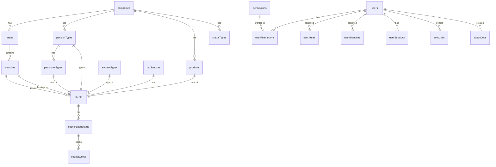

# Database Seeding Strategy

## Overview
This document outlines the strategy for generating high-quality, contextually relevant dummy data for the Client Updater application using Drizzle ORM and @faker-js/faker.

## Database Schema Analysis

### Core Entities and Relationships



### Seeding Order (Dependency Chain)

1. **Lookups** (already exists) - Reference data
2. **Organization** - Areas and Branches
3. **Users** - User accounts with permissions and assignments
4. **Clients** - Client records
5. **Client Period Status** - Current status for clients
6. **Status Events** - Audit trail for status changes
7. **Jobs** - Sync jobs and export jobs
8. **Activity Logs** - User activity logging (makes app feel "live")
9. **Config Settings** - Basic system settings

## Seeding Strategy

### 1. Organization Data (`seed/organization.ts`)

**Goal**: Create a realistic organizational hierarchy

**Data Requirements**:
- **Areas**: 3 geographic areas (e.g., "Metro Manila", "Luzon North", "Visayas")
- **Branches**: 4-6 branches distributed across areas
- **Branch Contacts**: Phone and email contacts for each branch

**Contextual Relevance**:
- Use realistic Philippine geographic names
- Assign branches to areas logically
- Create primary and secondary contacts for each branch

**Faker Usage**:
- `faker.location.city()` for branch names
- `faker.location.streetAddress()` for branch locations
- `faker.phone.number()` for contact numbers
- `faker.internet.email()` for contact emails

### 2. Users Data (`seed/users.ts`)

**Goal**: Create realistic user accounts with proper permissions and territory assignments

**Data Requirements**:
- **Admin Users**: 1-2 users with full permissions
- **Area Managers**: 1-2 users with area-level access
- **Branch Officers**: 2-3 users with branch-level access
- **Regular Users**: 2-3 users with self-only access

**Contextual Relevance**:
- Use realistic Filipino names
- Assign appropriate permissions based on role
- Link users to areas/branches they should manage
- Create realistic email addresses

**Faker Usage**:
- `faker.person.fullName()` for names
- `faker.internet.email()` for emails
- `faker.date.recent()` for last login timestamps

### 3. Clients Data (`seed/clients.ts`)

**Goal**: Create realistic pension client records

**Data Requirements**:
- **Total Clients**: 20-30 clients
- **Distribution**: Spread across branches and pension types
- **Pension Numbers**: Realistic format (e.g., SSS numbers, GSIS numbers)
- **Contact Info**: Valid phone numbers

**Contextual Relevance**:
- **SSS Clients**: Use realistic SSS number format (10 digits)
- **GSIS Clients**: Use realistic GSIS number format
- **PVAO Clients**: Use realistic military pensioner names
- **PCNI Clients**: Use realistic PNP and non-PNP pensioner names
- **Birth Dates**: Age-appropriate (60-90 years old for pensioners)
- **Full Names**: Realistic Filipino names

**Faker Usage**:
- `faker.person.fullName()` for names
- `faker.date.birthdate({ min: 1935, max: 1965 })` for pensioner ages
- `faker.phone.number('09#########')` for Philippine mobile numbers
- Custom helpers for pension number formats

### 4. Client Period Status (`seed/client-status.ts`)

**Goal**: Create realistic status tracking for clients

**Data Requirements**:
- **Current Period**: Status for current month (January 2026)
- **Status Distribution**: Mix of PENDING, TO_FOLLOW, CALLED, VISITED, UPDATED, DONE
- **Reason Distribution**: Appropriate reasons for DONE status (DECEASED, FULLY_PAID, CONFIRMED, NOT_REACHABLE)
- **Update Counts**: Varying numbers of updates (0-3)
- **Has Payment**: Mix of true/false

**Contextual Relevance**:
- Assign status based on PAR status (Current, 30+, 60+)
- Higher update counts for DONE status
- Terminal statuses should have isTerminal=true
- Payment status should align with status type

**Faker Usage**:
- `faker.helpers.arrayElement()` for status selection
- `faker.number.int({ min: 0, max: 5 })` for update counts
- `faker.date.recent()` for update timestamps

### 5. Status Events (`seed/status-events.ts`)

**Goal**: Create audit trail for status changes

**Data Requirements**:
- **Events per Client**: 1-2 events per client with status history
- **Event Sequence**: Sequential numbering per client
- **Created By**: Link to actual users

**Contextual Relevance**:
- Events should show logical progression (e.g., PENDING -> CALLED -> VISITED -> DONE)
- Include status changes with reasons
- Track payment status changes

**Faker Usage**:
- `faker.date.past()` for event timestamps
- `faker.helpers.arrayElement()` for user selection

### 6. Jobs Data (`seed/jobs.ts`)

**Goal**: Create realistic sync and export job records

**Data Requirements**:
- **Sync Jobs**: 3-5 completed/pending jobs
- **Export Jobs**: 2-3 completed/pending jobs
- **Job Status**: Mix of pending, processing, completed, failed

**Contextual Relevance**:
- Snowflake sync jobs for FCASH products
- NextBank sync jobs for PCNI products
- Export jobs for various report types
- Realistic record counts

**Faker Usage**:
- `faker.number.int({ min: 100, max: 1000 })` for record counts
- `faker.date.recent()` for job timestamps
- `faker.helpers.arrayElement()` for status selection

### 7. Activity Logs (`seed/activity-logs.ts`)

**Goal**: Create realistic user activity logs to make the app feel "live"

**Data Requirements**:
- **Total Logs**: 20-30 activity entries
- **Actions**: login, view_client, update_status, export_report, etc.
- **Users**: Link to actual seeded users
- **Resources**: clients, status, reports

**Contextual Relevance**:
- Recent activity (last 30 days)
- Mix of different user actions
- Some actions with duration (API calls)
- Realistic IP addresses

**Faker Usage**:
- `faker.date.recent({ days: 30 })` for timestamps
- `faker.internet.ip()` for IP addresses
- `faker.helpers.arrayElement()` for action selection

### 8. Config Settings (`seed/config.ts`)

**Goal**: Seed basic system configuration settings

**Data Requirements**:
- **Settings**: 5-10 key-value pairs
- **Types**: string, number, boolean, json
- **Scope**: System-wide and company-specific

**Contextual Relevance**:
- App name and version
- Default tracking cycle
- Notification settings
- Sync intervals
- Feature flags

**Faker Usage**:
- Minimal - mostly static configuration values

## Implementation Details

### File Structure

```
src/server/db/seed/
├── index.ts              # Main entry point
├── lookups.ts            # Existing - reference data
├── permissions.ts        # Existing - permissions
├── helpers.ts            # NEW - shared helper functions
├── organization.ts       # NEW - areas, branches, contacts
├── users.ts              # NEW - users, permissions, assignments
├── clients.ts            # NEW - client records
├── client-status.ts      # NEW - client period status
├── status-events.ts      # NEW - status event audit trail
├── jobs.ts               # NEW - sync and export jobs
├── activity-logs.ts      # NEW - user activity logs
└── config.ts             # NEW - system configuration
```

### Helper Functions

Create a shared helper file `src/server/db/seed/helpers.ts`:

```typescript
// Realistic Filipino names
export const FILIPINO_FIRST_NAMES = [...];
export const FILIPINO_LAST_NAMES = [...];

// Pension number generators
export function generateSSSNumber(): string { ... }
export function generateGSISNumber(): string { ... }
export function generatePVAONumber(): string { ... }

// Philippine phone number generator
export function generatePhilippineMobileNumber(): string { ... }
```

### Configuration

Create a config object for seed data quantities:

```typescript
const SEED_CONFIG = {
  areas: 3,
  branchesPerArea: { min: 1, max: 3 },
  adminUsers: 1,
  areaManagers: 2,
  branchOfficers: 3,
  regularUsers: 2,
  clientsPerBranch: { min: 3, max: 6 },
  statusEventsPerClient: { min: 1, max: 2 },
  syncJobs: 5,
  exportJobs: 3,
  activityLogs: 25,
  configSettings: 8,
} as const;
```

## Execution Plan

### Step 1: Install Dependencies
```bash
pnpm add -D @faker-js/faker
```

### Step 2: Create Seed Files
Create each seed file in order of dependency

### Step 3: Update Main Index
Update `src/server/db/seed/index.ts` to call new seed functions

### Step 4: Run Seed
```bash
pnpm db:seed
```

### Step 5: Verification
- Check database for expected record counts
- Verify foreign key relationships
- Confirm data quality and contextual relevance

## Data Quality Checks

### Foreign Key Integrity
- All `clientId` references must exist in `clients` table
- All `userId` references must exist in `users` table
- All `branchId` references must exist in `branches` table
- All `areaId` references must exist in `areas` table
- All lookup IDs must reference existing records

### Business Logic Validation
- Client birth dates should be reasonable for pensioners (60-90 years old)
- Status events should show logical progression
- User permissions should match their role
- Branch assignments should match user scope
- Payment status should align with status type

### Data Consistency
- Client codes should be unique
- Email addresses should be unique
- Phone numbers should follow Philippine format
- Pension numbers should follow appropriate formats

## Error Handling

Each seed function should:
1. Check for existing data before inserting
2. Use transactions where appropriate
3. Provide clear error messages
4. Log progress and results

## Future Considerations

- Add environment-specific seed configurations (dev vs test)
- Create seed data for specific test scenarios
- Support incremental seeding (add more data without duplicates)
- Add seed data reset functionality
